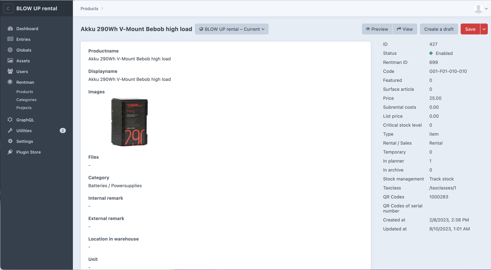
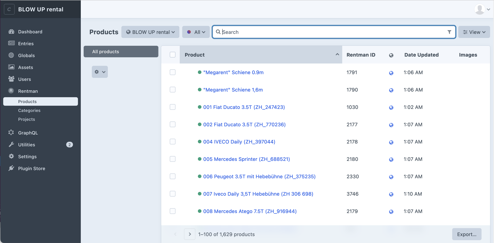
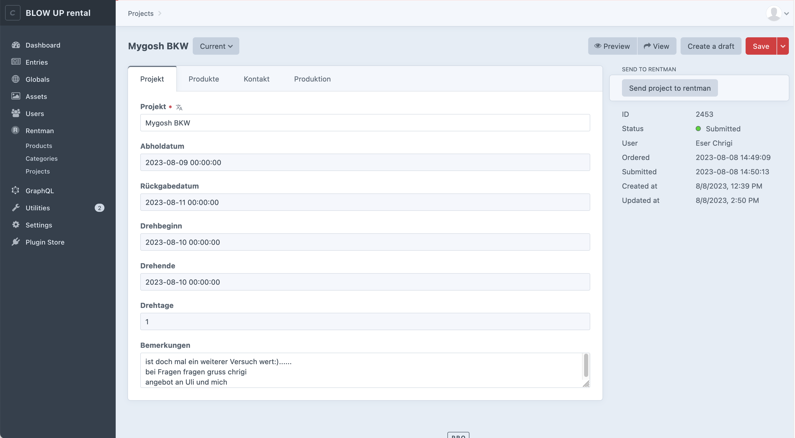

<h1 align="left">Rentman for Craft</h1>
<p>Automatically import <a href="https://rentman.io/" target="_blank">Rentman</a> products to <a href="https://craftcms.com/" target="_blank">Craft</a>. It lets visitors create orders. Orders are automatically sent to Rentman as project requests.</p>







## Requirements

This plugin requires Craft CMS 4.3.5 or later, and PHP 8.0.2 or later.

## Installation

You can install this plugin from the Plugin Store or with Composer.

#### From the Plugin Store

Go to the Plugin Store in your project’s Control Panel and search for “Rentman for Craft”. Then press “Install”.

#### With Composer

Open your terminal and run the following commands:

```bash
# go to the project directory
cd /path/to/my-project.test

# tell Composer to load the plugin
composer require furbo/rentman-for-craft

# tell Craft to install the plugin
./craft plugin/install rentman-for-craft
```

## Craft Setup Example

1. Go to Settings > Plugins > Rentman for Craft > Main settings
2. Add the API URL, usually `https://api.rentman.net/`
3. Add the API Key, more infos here: https://support.rentman.io/hc/en-us/articles/360013767839-The-Rentman-API
4. Choose the templates and urls for products, categories and projects
5. Click on the **Customisation** tab: here you can choose your own templates and settings for generated emails and pdfs


## Code Examples

### Get a single product
```

{{product.displayname}}
```

<hr />

### Get products by category
```
<ul>

    <li><a href="{{product.getUrl()}}">{{product.displayname}}</a></li>

</ul>
```

<hr />

### Get all products
```
<ul>

    <li><a href="{{product.getUrl()}}">{{product.displayname}}</a></li>

</ul>
```

<hr />

### Get main categories
```
<ul>

    <li><a href="{{mainCategory.getUrl()}}">{{mainCategory.displayname}}</a></li>

</ul>
```

<hr />

### Get categories first two levels
```
<ul>

    <li><a href="{{mainCategory.getUrl()}}">{{mainCategory.displayname}}</a></li>
    
        <ul>
        
            <li><a href="{{child.getUrl()}}">{{child.displayname}}</a></li>
        
        </ul>
    

</ul>
```
<hr />


### Get all categories in an array (recursive)

```
  
```
<hr />

### Print full categories tree
```
{{craft.rentman.printCategoryTree(true)|raw}}
```
<hr />

### Print full categories tree with active category
```
{{craft.rentman.printCategoryTree(true, 3162)|raw}}
```
<hr />

### Print partial categories tree with active category
```
{{craft.rentman.printCategoryTree(false, 3193)|raw}}
```


## Translations

You can copy the `rentman-for-craft.php` translations files from the plugin's translations folder to your site's translations folder and translate them there.


## Support

If you have any issues with this plugin, please [create an issue](https://github.com/tonioseiler/rentmanforcraft/issues) on GitHub or contact us at [Furbo](mailto:support@furbo.ch).
