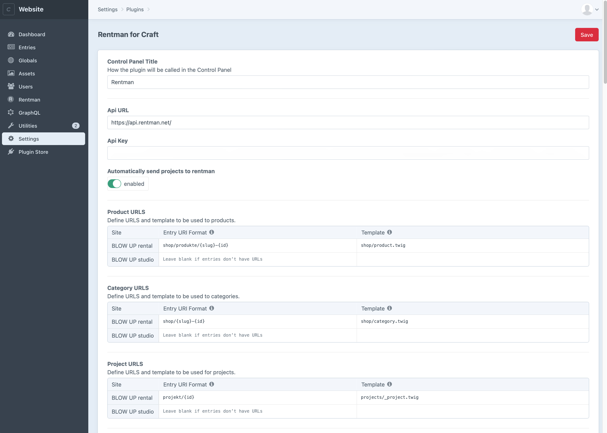
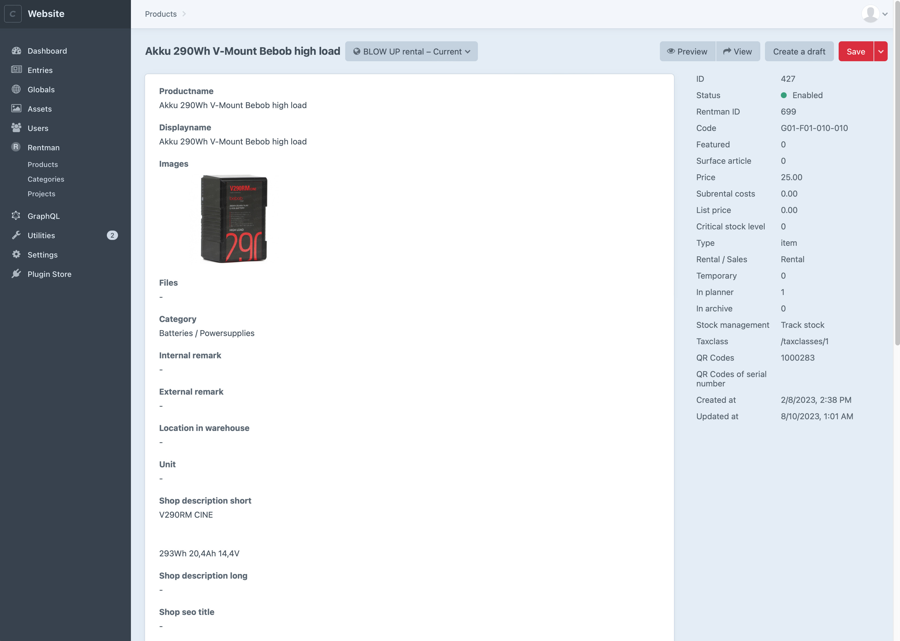
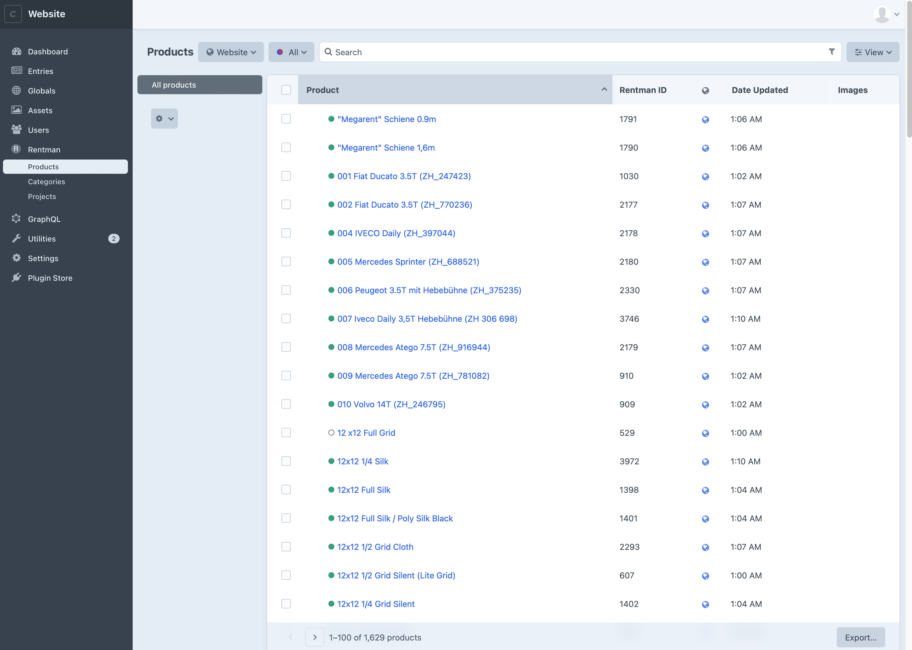
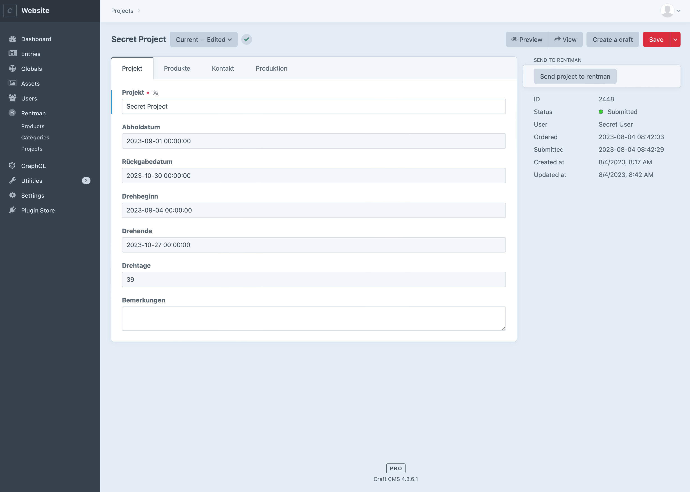

<h1 align="left">Rentman for Craft</h1>
<p>Automatically import <a href="https://rentman.io/" target="_blank">Rentman</a> products to <a href="https://craftcms.com/" target="_blank">Craft</a>. It lets visitors create orders. Orders are automatically sent to Rentman as project requests.</p>








## Requirements

This plugin requires Craft CMS 4.2.0 or later, and PHP 8.0.2 or later.

## Installation

You can install this plugin from the Plugin Store or with Composer.

#### From the Plugin Store

Go to the Plugin Store in your project’s Control Panel and search for “Rentman for Craft”. Then press “Install”.

#### With Composer

Open your terminal and run the following commands:

```bash
# go to the project directory
cd /path/to/my-project.test

# tell Composer to load the plugin
composer require furbo/rentman-for-craft

# tell Craft to install the plugin
./craft plugin/install rentman-for-craft
```

## Craft Setup Example

1. Go to Settings > Plugins > Rentman for Craft > Main settings
2. Add the API URL, usually `https://api.rentman.net/`
3. Add the API Key, more infos here: https://support.rentman.io/hc/en-us/articles/360013767839-The-Rentman-API
4. Add a cron job that executes the php script `httpdocs/craft rentman-for-craft/rentman/update-all` (adapt the path to your installation) for example once a day
5. Choose the templates and urls for products, categories and projects
5. Click on the **Customisation** tab: here you can choose your own templates and settings for generated emails and pdfs


## Code Examples

### Get a single product
```

{{product.displayname}}
```

<hr />

### Get products by category
```
<ul>

    <li><a href="{{product.getUrl()}}">{{product.displayname}}</a></li>

</ul>
```

<hr />

### Get all products
```
<ul>

    <li><a href="{{product.getUrl()}}">{{product.displayname}}</a></li>

</ul>
```

<hr />

### Get main categories
```
<ul>

    <li><a href="{{mainCategory.getUrl()}}">{{mainCategory.displayname}}</a></li>

</ul>
```

<hr />

### Get categories first two levels
```
<ul>

    <li><a href="{{mainCategory.getUrl()}}">{{mainCategory.displayname}}</a></li>
    
        <ul>
        
            <li><a href="{{child.getUrl()}}">{{child.displayname}}</a></li>
        
        </ul>
    

</ul>
```
<hr />


### Get all categories in an array (recursive)

```
  
```
<hr />

### Print full categories tree
```
{{craft.rentman.printCategoryTree(true)|raw}}
```
<hr />

### Print full categories tree with active category
```
{{craft.rentman.printCategoryTree(true, 3162)|raw}}
```
<hr />

### Print partial categories tree with active category
```
{{craft.rentman.printCategoryTree(false, 3193)|raw}}
```

### Product page
```


{{ product.displayname }}


    
    <h1>{{ product.displayname }}</h1>
    <div>Code: {{ product.code }}</div>
    <div>Price day: CHF {{ product.price }}.-</div>
    
        <div>Weight: {{ product.weight }}kg</div>
    
    <br>
    <div class="description">
        {{ product.shop_description_short|raw }}
    </div>
    
    
    
        <ul class="files">
            
                
                    <li><a href="{{ file.url }}" target="_blank">{{ file.displayname }}</a></li>
                
            
        </ul>
    
    
    <div class="image">
        
        
            
        
    </div>
    
    <div class="accessories">
        <h2>Set content</h2>
        <div class="accessories__content">
            
                
                
                    <div class="accessories__single">
                        
                            <a href="/{{ product.uri }}">
                                
                                
                                    {{ images[0].url }}
                                    {{ product.title }}
                                
                                    {{ product.title }}
                                
                            </a>
                        
                            
                            
                                {{ images[0].url }}
                                {{ product.title }}
                            
                                 {{ product.title }}
                            
                        
                    </div>
                
            
        </div>
    </div>
    
    
        
        
            
                
                    
                    
                        
                    
                
            
        
        
            <div class="accessories">
                <h2>Accessories</h2>
                <div class="accessories__content">
                    
                        
                        
                            <div class="accessories__single">
                                
                                    <a href="/{{ accProduct.uri }}">
                                        
                                        
                                            {{ images[0].url }}
                                            {{ accProduct.title }}
                                        
                                            {{ accProduct.title }}
                                        
                                    </a>
                                
                                  
                                    
                                        {{ images[0].url }}
                                        {{ accProduct.title }}
                                    
                                        {{ accProduct.title }}
                                    
                                
                            </div>
                        
                    
                </div>
            </div>
        
    ...

```

### Category page
```


    
    
        
    

{{ category.displayname }}


    
    
    {# list products that are directly in this category #}
    <div class="products-list">
        
            <div class="header listitem grid">
                <div>Title</div>
                <div class="weight">kg</div>
                <div class="price">CHF</div>
                <div></div>
            </div>
            
                <div>
                    <div><a href="/{{ product.uri }}">{{ product.displayname }}</a></div>
                    <div class="weight">{{ product.weight ? product.weight : '-' }}</div>
                    <div class="price">{{ product.price|number_format(2, '.', '’') }}</div>
                    <div class="chooser">
                        <input type="text" pattern="[0-9]+" maxlength="2" value="{{ craft.rentman.getProjectProductQuantity(product.id) }}" class="product-quantity" data-product-id="{{ product.id }}">
                        <span class="icon-minus product-quantity-minus"></span>
                        <span class="icon-plus product-quantity-plus"></span>
                    </div>
                </div>
            
        
    </div>
    
    {# list subcategories and related products #}
    
    
        
        
            <h2 class="cat-name"><a href="/{{ subcat.uri }}">{{ subcat.displayname }}</a></h2>
            <div class="header listitem grid">
                <div>Title</div>
                <div class="weight">kg</div>
                <div class="price">CHF</div>
                <div></div>
            </div>
            
                <div class="listitem grid">
                    <div><a href="/{{ product.uri }}">{{ product.displayname }}</a></div>
                    <div class="weight">{{ product.weight ? product.weight : '-' }}</div>
                    <div class="price">{{ product.price|number_format(2, '.', '’') }}</div>
                    <div class="chooser">
                        <input type="text" pattern="[0-9]+" maxlength="2" value="{{ craft.rentman.getProjectProductQuantity(product.id) }}" class="product-quantity" data-product-id="{{ product.id }}">
                        <span class="icon-minus product-quantity-minus"></span>
                        <span class="icon-plus product-quantity-plus"></span>
                    </div>
                </div>
            
        
    
    

```

### Project page
```


    
    
    
        
        
    
        
        
            
                
            
        
    

    
    
        

            
        
            <h1">{{ project.title }}</h1>
            
                <div id="project-submit-button-container">
                    
                    
                        <button class="mt-5" type="button" onclick="window.location.href='/cart';">cart</button>
                        <button class="mt-5" type="button" onclick="window.location.href='/project-edit';">Edit Project</button>
                        
                            
                        
                        <form id="project-submit" method="post" accept-charset="UTF-8" enctype="multipart/form-data" class="inline">
                            {{ csrfInput() }}
                            {{ actionInput('/rentman-for-craft/api/submit-project') }}
                            {{ hiddenInput('projectId', project.id) }}
                            {{ redirectInput('/tnxs') }}
                            <button class="mt-5" type="submit" {{ missingRequiredFields ?  'disabled' }}>Send request</button>
                        </form>
                        
                        
                            <h2>NOTE</h2>
                            <a href="/project-edit">Edit the project</a> to be able to submit it
                        
                    
                        
                            <button class="project-setactive mt-5" type="button" data-project-id="{{ project.id }}">Activate project</button>
                        
                        <button class="project-copy mt-5" type="button" data-project-id="{{ project.id }}">Projekt kopieren</button>
                    
                </div>
                <br>
                <div><strong>Shooting days::</strong> {{ project.shooting_days }}</div><br>
                <div>
                    <table>
                        <thead>
                        <tr class="border-b-2 border-b-darkgrey">
                            <th scope="col">Title</th>
                            <th scope="col">kg</th>
                            <th scope="col">CHF</th>
                            <th scope="col">
                                <span class="hidden sm:inline">Quantity </span><span class="inline sm:hidden">Qty</span>
                            </th>
                            <th scope="col">Total ({{ project.shooting_days > 1 ? project.shooting_days~' Days' : '1 Day' }})</th>
                        </tr>
                        </thead>
                        <tbody>
                        
                        
                            
                            <tr>
                                <th scope="row">
                                    {{ category.displayname }}:
                                </th>
                            </tr>
                            
                                
                                <tr>
                                    <th scope="row" ">
                                        <a href="/{{ productMainData.uri }}">{{ productMainData.displayname }}</a>
                                    </th>
                                    <td>
                                        {{ productMainData.weight }}
                                    </td>
                                    <td>
                                        {{ productMainData.price|number_format(2, '.', '’') }}
                                    </td>
                                    <td>
                                        {{ product.quantity }}
                                    </td>
                                    <td>
                                        {{ product.price|number_format(2, '.', '’') }}
                                    </td>
                                </tr>
                            
                        
                        <tfoot>
                            <tr>
                                <td colspan="5">
                                    {{ project.price|number_format(2, '.', '’') }}
                                </td>
                            </tr>
                        </tfoot>
                        </tbody>
                    </table>
                </div>
                <div class="customer-main-data">
                    <div>
                        <div>
                            {{ project.contact_person_first_name }} {{ project.contact_person_lastname }}<br>
                            {{ project.contact_mailing_street }}<br>
                            {{ project.contact_mailing_postalcode }}  {{ project.contact_mailing_city }}
                            {{ project.contact_mailing_country }}
                        </div>
                        <div>
                            {{ project.contact_person_email }}<br>
                            {{ project.contact_mailing_number }}<br>
                        </div>
                    </div>
                </div>
                <hr>
                <div class="customer-production-data">
                    <div>Produktion</div>
                    <div>
                        {{ project.location_name }}
                        {{ project.location_mailing_street }}
                        {{ project.location_mailing_postalcode }}
                        {{ project.location_mailing_city }}
                        {{ project.location_mailing_country }}
                        {{ project.location_mailing_number }}
                    </div>
                </div>
                <hr>
                <div class="project-dates">
                    <div>Abholdatum:<br>{{ project.in|date }}</div>
                    <div>Rückgabedatum:<br>{{ project.out|date }}</div>
                    <div>Drehbeginn:<br>{{ project.planperiod_start|date }}</div>
                    <div>Drehende:<br>{{ project.planperiod_end|date }}</div>
                </div>
               
                
                    <div>Contact name, telephoon, email and notes:</strong><br>{{ project.remark|nl2br }}</div>
                
        
                <div id="project-submit-button-container">
                    
                    
                        <button type="button" onclick="window.location.href='/cart';">Cart</button>
                        <button type="button" onclick="window.location.href='/project-edit';">Edit project</button>
                        
                            
                        
                        <form id="project-submit" method="post" accept-charset="UTF-8" enctype="multipart/form-data" class="inline">
                            {{ csrfInput() }}
                            {{ actionInput('/rentman-for-craft/api/submit-project') }}
                            {{ hiddenInput('projectId', project.id) }}
                            {{ redirectInput('/tnxs') }}
                            <button type="submit" {{ missingRequiredFields ?  'disabled' }}>Send request</button>
                        </form>
                        
                            <h2 class="mt-[2rem]">NOTE</h2>
                            <a href="/project-edit">Edit the project</a> to be able to submit it
                        
                    
                        
                            <button type="button" data-project-id="{{ project.id }}"Activate project</button>
                        
                        <button type="button" data-project-id="{{ project.id }}">Duplicate project</button>
                    
                </div>
            
                <div>Cart is empty</div>
                
                    
                        <button  type="button" data-project-id="{{ project.id }}">Activate project</button>
                    
                
            
         
         
            {# trying to access someone else's project #}
            
        
        
    
        {# project not defined #}
        
    
    

```

## Translations

You can copy the `rentman-for-craft.php` translations files from the plugin's translations folder to your site's translations folder and translate them there.


## Support

If you have any issues with this plugin, please [create an issue](https://github.com/tonioseiler/rentmanforcraft/issues) on GitHub or contact us at [Furbo](mailto:support@furbo.ch).
